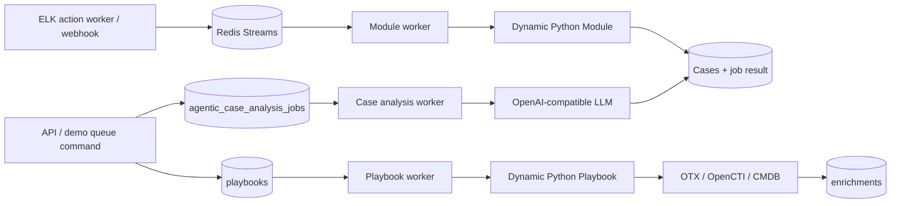

# Technical stack research inventory

Scope: repository state inspected on 2026-08-14. This is an implementation research note for a later user-facing technical documentation set. It intentionally does not reproduce secrets or modify the demo guide.

## Command inventory

Run all commands from `backend/`, so the documented prefix is `uv run python manage.py ...`. Every custom command also inherits Django's common `--help`, `--version`, `--verbosity {0,1,2,3}`, `--settings`, `--pythonpath`, `--traceback`, `--no-color`, `--force-color`, and `--skip-checks` options. The command definitions are the source of truth; the existing walkthrough gives the intended order and expected counts ([demo setup, lines 73-169](../demo/setup-and-reset.md#5-configure-alienvault-otx-for-live-enrichment)).

| Command | Command-specific options | Exact behavior / prerequisite |
|---|---|---|
| `seed_case_triage_demo` | `--no-reset`; `--include-live-llm`; `--include-complex-live-llm`; `--include-live-otx` | By default deletes only Cases with the `DEMO-CASE-TRIAGE-` correlation prefix and orphaned artifacts formerly linked to them, refreshes three demo users, then atomically creates 18 triage and 7 quality Cases. The three include flags add one unqueued Case each. `--no-reset` exits without changes if scoped data exists. See [seed options and reset behavior](../../backend/apps/cases/management/commands/seed_case_triage_demo.py#L353-L390) and [conditional live records](../../backend/apps/cases/management/commands/seed_case_triage_demo.py#L465-L542). |
| `queue_live_llm_case_demo` | none | Finds the simple live Case by correlation UID and requests an analysis job with trigger `demo_live_llm`; errors if not seeded. [Source](../../backend/apps/cases/management/commands/queue_live_llm_case_demo.py#L9-L27). |
| `queue_complex_llm_case_demo` | none | Finds the deterministic enriched Case and requests analysis with trigger `demo_complex_live_llm`; it does not enrich. [Source](../../backend/apps/cases/management/commands/queue_complex_llm_case_demo.py#L9-L28). |
| `queue_live_otx_enrichment_demo` | none | Requires the OTX Case plus enabled OTX config/API key, creates a Pending `Threat Intelligence Enrichment` playbook run, attributed to `demo.admin` if present. [Source](../../backend/apps/cases/management/commands/queue_live_otx_enrichment_demo.py#L11-L43). |
| `queue_live_otx_case_demo` | none | Refuses analysis until an AlienVault OTX enrichment is reachable through Case -> Alerts -> Artifacts; then requests trigger `demo_live_otx`. [Source](../../backend/apps/cases/management/commands/queue_live_otx_case_demo.py#L10-L32). |
| `reset_case_triage_demo` | required safety flag `--confirm` | Deletes only Cases whose `correlation_uid` begins `DEMO-CASE-TRIAGE-`, then deletes artifacts that were linked to those Cases and now have no Alerts. It retains demo users. [Source](../../backend/apps/cases/management/commands/reset_case_triage_demo.py#L7-L35). |
| `shell` (Django built-in) | `--no-startup`; `--no-imports`; `-i/--interface {ipython,bpython,python}`; `-c/--command COMMAND` | Interactive Django-aware interpreter or execute a supplied command and exit. The demo uses `-c` to inspect Case/job state ([example](../demo/setup-and-reset.md#7-verify-the-seed-then-queue-the-live-run)). |
| `run_agentic_case_analysis_worker` | `--once`; `--interval FLOAT` | One iteration or continuous polling; default idle sleep 3 seconds. [Command](../../backend/apps/agentic/management/commands/run_agentic_case_analysis_worker.py#L6-L24). |
| `run_agentic_playbook_worker` | `--once`; `--interval FLOAT` | Recovers all Running playbooks as failed on startup, then polls; default idle sleep 3 seconds. [Command](../../backend/apps/agentic/management/commands/run_agentic_playbook_worker.py#L9-L31). |
| `run_agentic_module_worker` | `--once`; `--interval FLOAT` | Polls discovered custom modules and Redis Streams; default idle sleep 3 seconds. [Command](../../backend/apps/agentic/management/commands/run_agentic_module_worker.py#L6-L24). |
| `run_dashboard_cache_worker` | `--once`; `--interval FLOAT` | Refreshes each dashboard time window in Redis; the UI Runtime setting supplies the interval unless overridden. [Source](../../backend/apps/dashboard/management/commands/run_dashboard_cache_worker.py#L17-L87). |
| `run_elk_action_worker` | `--index`; `--once`; `--interval`; `--size`; `--start-time` | Polls an ELK action index and sends hits to Redis streams. Settings UI supplies omitted index/interval/size; `--start-time` accepts an ISO timestamp. [Source](../../backend/apps/webhook/management/commands/run_elk_action_worker.py#L11-L59). |

Worker `--interval` must be greater than zero. Continuous workers refresh cached Runtime settings before every iteration, emit Redis-backed health heartbeats, sleep when idle (agentic workers) or every iteration (dashboard/ELK), catch/log per-iteration errors, and stop cleanly on Ctrl-C ([shared runner](../../backend/apps/common/worker_runner.py#L22-L41), [loop](../../backend/apps/common/worker_runner.py#L77-L127)).

## Stack and data stores

The backend is a Django ASGI/WSGI application with Django REST Framework, JWT/API-key auth, Channels, filtering, schema generation, Redis cache support, and S3-compatible attachment storage. The full installed-app list is in [settings](../../backend/asp/settings.py#L40-L75). Development runs PostgreSQL 17, Redis Stack, and RustFS as persistent Docker services ([compose](../../development/docker/compose.yaml#L1-L58)); `start.sh` launches the ASGI backend, case-analysis worker, playbook worker, and Vite frontend ([startup process list](../../start.sh#L61-L74)).

There is exactly one configured Django relational database alias, `default`, using PostgreSQL. Its database, user, password, host, port, persistent-connection lifetime, and connection health checks are environment-driven ([database settings](../../backend/asp/settings.py#L109-L120)). PostgreSQL is not merely storage: analysis de-duplication uses a transaction-scoped PostgreSQL advisory lock keyed by Case UUID, while row transitions use `select_for_update` ([analysis queue service](../../backend/apps/agentic/services/cases.py#L18-L57)); playbook claiming also uses an atomic `select_for_update` transaction ([playbook claim](../../backend/apps/agentic/services/playbooks.py#L138-L182)).

Redis is a different datastore, not a Django database alias. One configured Redis URL backs Django's cache and Channels ([settings](../../backend/asp/settings.py#L122-L150)), worker health, dashboard snapshots/locks, and JSON Redis Streams. Streams use consumer groups, approximate max-length trimming, blocking reads, and `noack=True`, so consumed module messages are not replayed by an acknowledgement/retry mechanism ([stream client](../../backend/apps/common/redis_stream.py#L33-L77)). RustFS is S3-compatible object storage for attachment bodies; PostgreSQL retains attachment metadata ([storage settings](../../backend/asp/settings.py#L226-L248), [attachment model](../../backend/apps/attachments/models.py#L7-L20)).

## PostgreSQL table inventory

This inventory was verified by Django model metadata (`apps.get_models(include_auto_created=True)`) without requiring a live database. Columns are grouped to keep the eventual reference readable; model files and migrations remain authoritative.

| Table(s) | Purpose / principal columns and relations |
|---|---|
| `users`, `users_groups`, `users_user_permissions`, `user_api_keys` | Custom Django user, inherited auth flags/profile and avatar FK; standard group/permission joins; hashed API credentials and use/expiry timestamps. [Models](../../backend/apps/accounts/models.py#L7-L57). |
| `auth_group`, `auth_group_permissions`, `auth_permission`, `django_content_type`, `django_session`, `django_migrations` | Django framework authorization, generic-relation type registry, sessions, and applied migration history. `django_migrations` is created by Django's migration recorder rather than an application model. |
| `cases` | Core incident record: readable ID, classification, analyst state, assignee, lifecycle/correlation, denormalized AI verdict/severity/impact/priority/confidence and serialized investigation report. [Model](../../backend/apps/cases/models.py#L85-L124). |
| `case_relationships` | Directed Case-to-Case edge with relationship type, note, creator, and normalized pair key. [Model](../../backend/apps/cases/models.py#L126-L170). |
| `alerts`, `alerts_artifacts` | Detection record linked to one Case, with source/analytic/MITRE/product/status/raw fields; many-to-many join to Artifacts. [Model](../../backend/apps/alerts/models.py#L170-L225). |
| `artifacts` | Normalized observable/entity: readable ID, name, type, role, and value. [Model](../../backend/apps/artifacts/models.py#L295-L307). |
| `enrichments` | Evidence linked optionally to one Case, Alert, or Artifact, carrying type/provider/UID, human summary, and detailed JSON. Model validation requires exactly one parent. [Model](../../backend/apps/enrichments/models.py#L170-L193). |
| `agentic_case_analysis_jobs` | Durable analysis queue/state: Case FK, Pending/Running/Success/Failed status, trigger/timestamps, error, and result JSON. [Model](../../backend/apps/agentic/models.py#L7-L36). |
| `playbooks`, `playbook_run_messages` | Durable playbook queue/state and ordered, sanitized progress messages. [Models](../../backend/apps/playbooks/models.py#L10-L63). |
| `knowledge` | Knowledge title/body/source/tags/expiry and optional one-to-one source Case. [Model](../../backend/apps/knowledge/models.py#L8-L31). |
| `comments`, `comments_mentions`, `comments_attachments` | Generic comments on supported content types, threaded parent FK, mentioned users, and attachment joins. [Model](../../backend/apps/comments/models.py#L7-L30). |
| `attachments` | Object access UUID, storage file key, original filename/size, uploader and timestamp. [Model](../../backend/apps/attachments/models.py#L7-L20). |
| `audit_logs` | Generic target, action, actor, field-change JSON, metadata JSON and time. [Model](../../backend/apps/audit/models.py#L7-L23). |
| `inbox_messages`, `inbox_message_recipients`, `inbox_messages_attachments` | Threadable/generic-target notifications/messages, recipient read state, and attachment join. [Models](../../backend/apps/inbox/models.py#L7-L82). |
| `user_table_preferences`, `saved_table_filters` | Per-user table layout/page-size and reusable/private-or-shared filter JSON. [Models](../../backend/apps/preferences/models.py#L5-L41). |
| `setting_llm_provider_configs` | Ordered enabled OpenAI-compatible providers: base URL, model, encrypted-at-rest status is **not established by this model**, API-key text, proxy and JSON tags. [Model](../../backend/apps/settings/models.py#L7-L22). |
| `setting_ti_alienvault_otx_config`, `setting_ti_opencti_config` | Singleton threat-intel endpoints, credentials, proxy/TLS and enabled state. [Models](../../backend/apps/settings/models.py#L28-L61). |
| `setting_siem_splunk_config`, `setting_siem_elk_config` | Singleton SIEM connection and ELK action-polling settings. [Models](../../backend/apps/settings/models.py#L71-L108). |
| `setting_ldap_config` | Singleton LDAP endpoint/domain/bind/search/login settings. [Model](../../backend/apps/settings/models.py#L118-L132). |
| `setting_runtime_config` | Singleton prompt language, Redis stream maximum length, dashboard refresh interval. [Model](../../backend/apps/settings/models.py#L142-L152). |
| `setting_custom_variables` | Typed JSON configuration/secret values used by custom playbooks/modules. [Model](../../backend/apps/settings/models.py#L162-L192). |

## Worker and runtime architecture

The runtime has three agentic execution paths:

- Case analysis and playbook queues are PostgreSQL tables, not Redis queues. The case worker selects the oldest scheduled Pending job, marks it Running transactionally, executes, then persists Success or Failed; no automatic retry is present ([monitor](../../backend/apps/agentic/runtime/monitor.py#L34-L59)).
- Playbook definitions are ordinary Python files. Built-ins under `backend/playbooks` are overlaid by same-named files under `backend/custom/playbooks`; later directories win. Files must define a top-level `Playbook` subclass of `BasePlaybook`, may not use relative imports, and are dynamically imported by resolved path ([loader](../../backend/apps/agentic/runtime/loader.py#L15-L50), [overlay](../../backend/apps/agentic/runtime/loader.py#L68-L78), [playbook directories](../../backend/apps/agentic/services/playbooks.py#L43-L89)).
- Custom Modules use only `backend/custom/modules`, must define `Module(BaseModule)` with `STREAM_NAME`, optionally `THREAD_NUM`, and are consumers in the shared `agentic-modules` group. The current runner iterates definitions serially and does not use `THREAD_NUM` to create threads; that field is discovery metadata today ([module runtime](../../backend/apps/agentic/runtime/module.py#L18-L75), [execution](../../backend/apps/agentic/runtime/module.py#L83-L124)).
- Playbook startup converts every persisted Running run to Failed as orphaned; it cannot prove which process owned a row. Run messages and final remarks redact common credential assignments before saving ([recovery](../../backend/apps/agentic/services/playbooks.py#L238-L256), [sanitization](../../backend/apps/agentic/services/playbooks.py#L19-L40)).
- Worker health is ephemeral Redis state. The UI's expected list includes module, case analysis, playbook, ELK action, and dashboard cache workers ([health registry](../../backend/apps/common/worker_health.py#L16-L22)).

## LLM investigation details

Provider records are read from Runtime configuration, filtered/enabled/ordered there, then `LLMAPI` selects the first provider or the first whose JSON tags contain all required tags. Investigation always requires `structured_output`. It constructs LangChain `ChatOpenAI` with temperature `0`, configured model/base URL/API key, optional explicit proxy behavior, and invokes `.with_structured_output(PydanticSchema)` ([adapter](../../backend/integrations/llm/llmapi.py#L7-L53), [structured invocation](../../backend/apps/agentic/analysis/prompts.py#L62-L72)). Thus “OpenAI-compatible” describes the protocol/client, not a restriction to OpenAI-hosted models.

The analysis worker serializes the Case using a versioned allowlist profile, including nested Alerts, Artifacts, and Enrichments, retrieves Knowledge context, then sends two messages: a language-selected Markdown system prompt (English fallback) and a JSON human message. The model must return `InvestigationReport`; ASP wraps it with trigger/source/profile/time/knowledge provenance in `AnalysisRecord`, denormalizes five recommendation fields onto the Case, stores the full record on both Case and job ([analysis pipeline](../../backend/apps/agentic/analysis/analysis.py#L27-L82), [prompt loading](../../backend/apps/agentic/analysis/prompts.py#L33-L72), [persistence](../../backend/apps/agentic/services/cases.py#L61-L87)).

Knowledge retrieval itself uses a structured LLM call to generate search keywords, then database matching; knowledge extraction is another structured LLM operation. These are separate from the final investigation call ([knowledge implementation](../../backend/apps/agentic/analysis/knowledge.py#L1-L139)). The user-facing docs should explicitly state that job errors are retained, failed jobs are not retried automatically, and a later enrichment does not mutate an already generated report.

## Enrichment details

An Enrichment is durable evidence, not an LLM response. It belongs to exactly one Case, Alert, or Artifact and retains a concise `desc` plus provider-native structured `data`. Alert ingestion can create Alert-level enrichments in the same service transaction ([alert service](../../backend/apps/agentic/services/alerts.py#L50-L81)). Enrichment playbooks instead collect unique Artifacts across all Case Alerts, call integrations, and upsert one Artifact Enrichment per provider/artifact/type under a row lock.

The built-in Threat Intelligence playbook calls the aggregator `query_indicator`, counts unsupported/errors without aborting the whole run, and upserts `THREAT_INTELLIGENCE` rows using UID `ti:{provider}:{artifact_id}` ([playbook](../../backend/playbooks/threat_intelligence_enrichment.py#L8-L52), [upsert](../../backend/playbooks/threat_intelligence_enrichment.py#L55-L95)). The custom CMDB playbook follows the same pattern with UID `cmdb:{provider}:{artifact_id}` and stores normalized technical/business context ([CMDB playbook](../../backend/custom/playbooks/cmdb_enrichment.py#L8-L52), [upsert](../../backend/custom/playbooks/cmdb_enrichment.py#L55-L97)). Enrichment must finish before queuing analysis if its evidence should be in that analysis snapshot.

## Gaps and documentation cautions

1. `start.sh` currently launches only the case-analysis and playbook workers, whereas the demo prose says it also starts all required services and some broader descriptions may imply the module/dashboard workers. Document actual startup separately from the five worker types, or fix startup before claiming all five run automatically ([script](../../start.sh#L61-L74)).
2. `THREAD_NUM` is exposed on Modules but unused by `run_all_modules_once`; do not document parallel module threads as implemented.
3. Redis Stream reads use `noack=True`; no pending-entry recovery or application retry is implemented. Avoid “guaranteed delivery” language.
4. LLM/API keys, TI tokens, LDAP bind password, SIEM password, and custom secret variables are model `TextField`/JSON values. No field-level encryption was found in the inspected model/runtime path; user-facing security docs should not claim encryption at rest unless deployment-level storage encryption is separately established.
5. “All databases” means one PostgreSQL Django database plus Redis and RustFS datastores in the current deployment. External ELK/Splunk/OpenCTI/OTX/LLM systems are integrations, not ASP-owned databases.
6. Actual tables in a deployed database depend on migration state. Before publishing an exact schema snapshot, run `showmigrations` and database introspection against the target deployment. This inventory represents current Django metadata, including implicit many-to-many tables, plus Django's migration recorder.
7. The requested external overview URL may be useful for screenshots/copy comparison, but it is not needed as authority for implementation details. Any borrowed screenshots require confirmation that they match this branch and that reuse is permitted.
