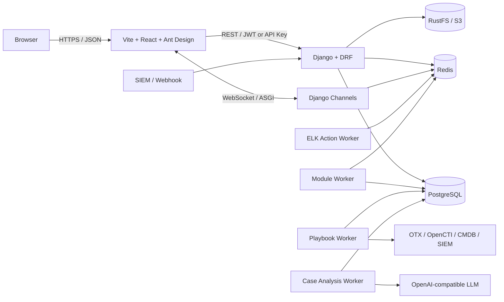

# Architecture and stack

## Overview

ASP is a decoupled SOC/SIRP web application. The Vite frontend uses React and Ant Design. Django supplies the REST API, authentication, ORM, management commands, and ASGI realtime layer. Separate worker processes perform asynchronous and long-running work.

## Layer responsibilities

| Layer | Main technology | Responsibility |
| --- | --- | --- |
| Web UI | Vite, React, Ant Design | Queues, record pages, settings, and user actions; never connects directly to a database or provider |
| API | Django, Django REST Framework | Business APIs, validation, filters, pagination, JWT/API Key permissions, and audit |
| Realtime | Django ASGI, Channels, channels-redis | WebSocket connections and cross-process events |
| Relational data | PostgreSQL | Authoritative Cases, Alerts, Artifacts, Enrichments, jobs, configuration, and audit state |
| Ephemeral state/messages | Redis | Django cache, Channels layer, Redis Streams, and worker heartbeats |
| Files | RustFS through its S3-compatible API | Attachment objects; PostgreSQL retains attachment metadata and object keys |
| Background execution | Django management-command workers | SIEM polling, module consumption, Case analysis, Playbooks, and dashboard cache refresh |
| AI/integrations | LangChain `ChatOpenAI`, HTTP APIs | Structured LLM output and OTX, OpenCTI, Splunk, ELK, and CMDB connectivity |

## Django's role

Django is more than the HTTP framework. It owns every business model and migration, uses the ORM for relationships and transactions, exposes resources through DRF, extends `AbstractUser`, and uses ContentTypes for generic Comment, AuditLog, and Inbox links. Management commands are also the process entry points for every worker and demo operation.

There is one Django database alias, `default`, using `django.db.backends.postgresql`. `POSTGRES_DB`, `POSTGRES_USER`, `POSTGRES_PASSWORD`, `POSTGRES_HOST`, and `POSTGRES_PORT` configure it; connection lifetime and health checks are configurable. There is no database router or second relational database.

## Synchronous and asynchronous boundaries

Normal CRUD completes in the HTTP request path. Expensive work first persists queue state and is processed by a worker. Case analysis and Playbooks use PostgreSQL rows as durable queues; detection modules use Redis Streams. Reloading a page only reads saved output and never implicitly invokes an LLM or enrichment provider.

## Configuration and runtime locations

- `backend/.env`: development connection parameters; deployments should inject secrets.
- `backend/apps/settings`: UI-managed LLM, threat intelligence, SIEM, LDAP, and Runtime settings.
- `backend/custom/modules`: dynamically discovered detection modules.
- `backend/custom/playbooks`: dynamically discovered Playbooks.
- `backend/data/playbooks` and `backend/custom/data/playbooks`: system and custom prompts.
- `.asp-runtime/`: local process PID and log files, not business storage.

Do not print API keys or passwords in documentation, logs, or shell diagnostics. Current configuration model fields are not application-level encrypted; protect the database, backups, and settings APIs accordingly.
