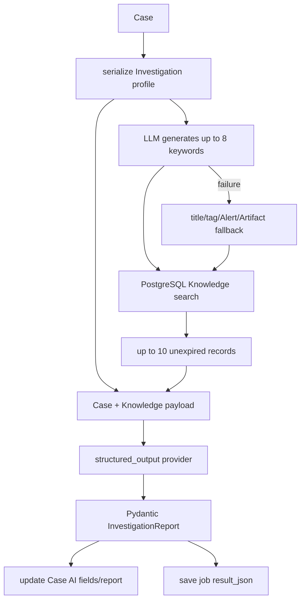
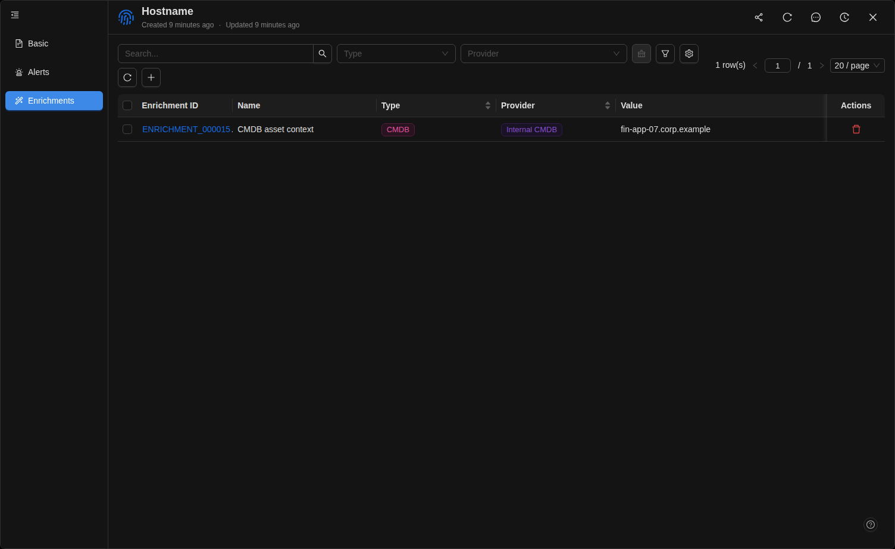
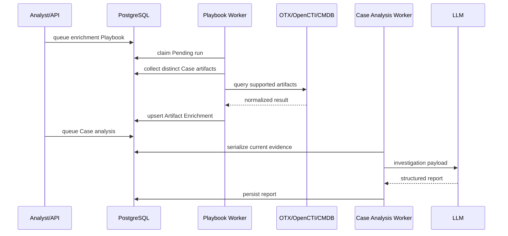

# LLM investigation and enrichment

## Provider selection

Administrators configure OpenAI-compatible providers with name, base URL, model, API key, proxy, tags, priority, and enabled state. Runtime reads enabled records ordered by priority, name, and creation time. Untagged selection uses the first record. Structured tasks require a provider whose tags contain `structured_output`.

ASP uses LangChain `ChatOpenAI` at temperature `0.0` and Pydantic `with_structured_output()` schemas. A configured proxy creates explicit synchronous and asynchronous HTTPX clients; an empty proxy disables environment-proxy inheritance. A successful provider connection test does not guarantee that its model can satisfy the structured schema.

## Two-stage Investigation flow



The first call generates Knowledge search terms. Failure falls back to deterministic terms instead of failing the investigation. The ORM matches title/body case-insensitively and tags by containment, filters expired records, and returns the latest ten. The second call sends the Case and Knowledge JSON as a HumanMessage with a file-backed System prompt.

The report schema contains verdict, severity, impact, priority, confidence, digest, affected assets, evidence findings, attack chain, timeline, indicators, remediations, and unknowns. Run metadata records the trigger, source identity, profile version, generation time, keywords, and Knowledge snapshot.

### Inspect the flow from the command line

The educational command below prints every stage and uses a real Case from the database. Preview mode does not call an LLM and substitutes the production fallback keywords so that it can still demonstrate the Knowledge query and final payload:

```bash
cd backend
uv run python manage.py explain_case_analysis case_000001
```

Add `--invoke` to make the same two structured LLM calls used by the worker:

```bash
uv run python manage.py explain_case_analysis case_000001 --invoke
```

An optional analyst instruction can be included with `--user-input "Focus on lateral movement"`. The command reads the same prompts, runtime provider configuration, serialization profile, Knowledge table, and output schemas as the worker. It is deliberately read-only: unlike the worker, it does not update the Case or a Case-analysis job. See the [Case Analysis CLI walkthrough](case-analysis-cli.md) for its complete output, safety behavior, and source mapping.

## What the LLM sees

The Investigation profile contains triage fields, assignee display name, Alerts, their Artifacts, summary fields from Enrichments at each level, Case comments, and up to 100 filtered Case audit entries. It intentionally excludes internal IDs, Alert `raw_data`/`unmapped`, Enrichment `data`, and previous Case AI fields so prior model output is not treated as new evidence.

Opening or refreshing Investigation only reads `cases.investigation_report_ai_json`. Only explicit enqueueing invokes the model. The LLM verdict is a recommendation, not a confirmed fact.



## Enrichment

An Enrichment is external or internal context attached to a Case, Alert, or Artifact. Common fields are name, type, provider, UID, value, description, and variable `data` JSON. The Case Enrichments tab only shows direct Case records; it does not flatten Alert- and Artifact-level records.

There are two production write paths:

1. A detection/custom Module submits Alert-level enrichment during ingestion.
2. A Threat Intelligence or CMDB Playbook collects distinct Artifacts below a Case, calls a provider, and creates or updates Artifact-level records.



Threat Intelligence can use AlienVault OTX and OpenCTI. The service normalizes provider responses and reports provider failures as errors, never as evidence. With no enabled provider it returns an explicit error and does not fall back to mock results. Each provider decides which Artifact types it supports.

## Ordering and consistency

Enrichment and LLM investigation are separate stages. To include fresh provider context, wait for Playbook Success before queueing analysis. An analysis does not wait on another queue, and later enrichment does not rewrite a saved report; explicitly queue a new analysis job.

Knowledge extraction is a separate structured-LLM Playbook. It only operates on a Case with an analyst verdict and maintains at most one Case-sourced Knowledge row. If the model finds nothing reusable, the prior extracted row is removed.
