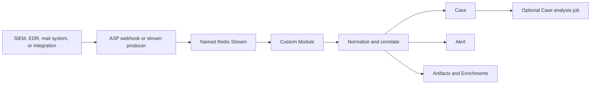

# Modules

Modules are dynamically discovered Python consumers that translate security events into ASP Cases, Alerts, Artifacts, and optional Enrichments. A Module listens to one named Redis Stream and handles one decoded JSON object at a time.

Modules are normally the boundary between source-specific event data and ASP's domain model:



A Module is not necessarily the component that detects malicious behavior. An upstream SIEM correlation search, EDR rule, or mail-report workflow can perform the detection and route only matching events to the Module's stream. The Module then validates the expected fields, assigns ASP semantics, extracts evidence, correlates related Alerts, and persists the result. A Module may perform additional checks itself, but that logic must be implemented explicitly in its `run()` method.

## Discovery and execution

The runtime scans top-level `*.py` files in `backend/custom/modules/`, excluding `__init__.py`. A valid file defines a top-level class named exactly `Module` that inherits `BaseModule`. Relative imports are rejected.

The class-level definition contract is:

| Attribute | Required | Purpose |
| --- | --- | --- |
| `NAME` | No | Human-readable name in **Custom → Modules**; the filename stem is the fallback. |
| `DESC` | No | Description displayed in the Module catalog. |
| `STREAM_NAME` | Yes | Exact Redis Stream from which the Module consumes events. |
| `THREAD_NUM` | No | Discovery metadata; defaults to `1` and does not currently create worker threads. |

`run_agentic_module_worker` rescans definitions on each polling iteration. For every discovered definition it ensures the shared `agentic-modules` consumer group exists, reads at most one new message, decodes the stream field named `data` as JSON, instantiates the Module, and calls `run(message_data)`.

All reads use `noack=True`. Delivery is therefore at-most-once from ASP's perspective: malformed JSON and uncaught Module errors are logged, but the consumed message is not retried. Module persistence should use transactional services such as `create_alert_with_context()` so a failure does not leave a partially created Case and Alert.

The worker iterates definitions serially. `THREAD_NUM` is visible in the UI but is not used for concurrency. Run additional Module worker processes when more consumption capacity is required.

## What the Custom UI shows

**Custom → Modules** is an administrator-facing catalog and diagnostic view. It shows the definitions currently loaded from disk, their descriptions and paths, and Redis Stream health including length, first and last IDs, consumer groups, consumers, and pending counts. Selecting a Module can display recent stream messages or retrieve one by message ID.

**Refresh / Validate** rescans and imports the Python files and reports loading errors. It does not execute a Module or replay a message. **Reload** only retrieves the current API result again.

## Current Modules

The repository currently supplies two definitions under `backend/custom/modules/`.

### User Reported Phishing Mail

File: `backend/custom/modules/mail_user_report_phishing.py`  
Stream: `Mail-01-User-Report-Phishing-Mail`

This Module turns a user-reported suspicious email into an email-security Alert and a correlated phishing Case.

Its `run()` method performs these steps:

1. It requires the message to be a dictionary.
2. It reads sender, recipient, subject, and date from either direct fields or mail headers. The reporter, message ID, URLs, domains, body, and attachments use direct or ECS-like field names where supported.
3. It normalizes email addresses to lowercase, extracts URLs from the body when no URL list is supplied, derives hostnames from URLs when no domain list is supplied, and parses the event time. A missing or invalid time falls back to the current time; parse details are retained in `unmapped`.
4. It rejects an event only when all of sender, subject, and URLs are absent. It does not decide whether the message is actually phishing; the upstream user-report workflow and stream routing provide that context.
5. It converts `event.risk_score` to a number, defaulting to `60`. Scores of `70` or more produce High severity/risk; lower scores produce Medium severity/risk.
6. It creates a daily correlation UID from the stream/rule ID, sender domain, normalized subject, and first URL domain. Events with the same non-empty correlation keys in the same timestamp-derived day bucket reuse the existing Case.
7. It builds Artifacts for the sender, recipient, reporter, subject, message ID, URLs, domains, attachment filenames, and attachment SHA-256 hashes.
8. It calls `create_alert_with_context()` to create the Case if necessary, always add a new Alert, attach the Artifacts, and schedule Case analysis.

Important input fields include:

| Meaning | Accepted fields |
| --- | --- |
| Sender | `sender`, then header `From` |
| Recipient | `recipient`, then header `To` |
| Reporter | `reporter` or `user.email` |
| Subject | `subject`, then header `Subject` |
| Event time | `eventTime`, `@timestamp`, then header `Date` |
| Message ID | `message_id` or `email.message_id` |
| URLs | `urls`, `email.urls`, or URLs extracted from `body` |
| Domains | `domains`, otherwise derived from URLs |
| Risk score | `event.risk_score`, default `60` |

The created Alert retains the complete input object in `raw_data`. Derived domains, attachment count, and any time parsing error are retained in `unmapped`.

### EDR Vssadmin Delete Shadows

File: `backend/custom/modules/edr_vssadmin_delete_shadows.py`  
Stream: `EDR-01-HOST-Vssadmin-Delete-Shadows`

This Module maps an endpoint event for `vssadmin.exe` shadow-copy deletion to a ransomware-related Alert and Case. It assigns MITRE ATT&CK tactic **Impact** and technique **T1490 - Inhibit System Recovery**.

Its `run()` method performs these steps:

1. It requires the message to be a dictionary.
2. It reads ECS-style fields in either flattened form, such as `host.name`, or nested form, such as `{"host": {"name": "..."}}`.
3. It extracts event time, host name/IP, user, process name and command line, parent process, executable/file path, and SHA-256 or MD5 hash.
4. It rejects an event only when both host name and command line are absent.
5. It converts `event.risk_score` or `risk_score` to a number, defaulting to `100`. Scores of `90` or more are Critical; lower scores are High. Case impact and priority remain Critical.
6. It creates a daily correlation UID from the stream/rule ID, host, user, and command line or process name. Matching events in the same time bucket attach new Alerts to the existing Case.
7. It creates typed Artifacts for the affected host and IP, source user, process, command line, parent process, file path, and file hash.
8. It creates the Alert and Case transactionally and schedules Case analysis.

The Module does **not** check that the command contains `vssadmin`, `delete`, or `shadows`. The upstream EDR/SIEM rule must send only matching events to `EDR-01-HOST-Vssadmin-Delete-Shadows`, or a new Module must add explicit detection validation before persistence.

Important input fields include:

| Meaning | Accepted fields |
| --- | --- |
| Event time | `@timestamp` or `eventTime` |
| Host | `host.name` or nested `host.name` |
| Host IP | `host.ip` or nested `host.ip` |
| User | `user.name` or nested `user.name` |
| Process | `process.name` or nested `process.name`; defaults to `vssadmin.exe` |
| Command line | `process.command_line` or nested equivalent |
| Parent | `process.parent.name` or nested equivalent |
| Path | `file.path`, then `process.executable` |
| Hash | file/process SHA-256, then file MD5 |
| Risk score | `event.risk_score`, then `risk_score`, default `100` |

## Correlation and persistence

`generate_correlation_uid()` hashes the rule ID, a time bucket, and the sorted non-empty correlation keys into a stable value such as `corr-0123456789abcdef`. Sorting makes the keys order-independent. For a `24h` window, the bucket is the calendar day represented by the parsed event timestamp.

`create_alert_with_context()` is the preferred persistence boundary. It:

1. Requires the Case and Alert correlation UIDs to agree when both are supplied.
2. Takes a PostgreSQL advisory transaction lock for a non-empty correlation UID.
3. Reuses the earliest Case with that UID or validates and creates a new Case.
4. Validates and creates a new Alert linked to the Case.
5. Gets or creates each Artifact and attaches it to the Alert.
6. Creates any supplied Alert-level Enrichments.
7. Optionally requests Case analysis.

All of these writes occur transactionally. Correlation deduplicates the Case, not the Alert: every successfully handled stream message creates another Alert.

## How to create a new Module

Place a new top-level Python file directly in `backend/custom/modules/`. No registry change or database migration is required unless the feature also changes Django models.

The following example consumes a SIEM rule that reports repeated failed logins and creates an IAM Alert. It intentionally keeps source parsing, validation, correlation, and ASP mapping inside one small definition:

```python
from apps.agentic.runtime.base import BaseModule, generate_correlation_uid, parse_event_time
from apps.agentic.services.alerts import create_alert_with_context
from apps.alerts.models import (
    AlertAction,
    AlertAnalyticType,
    AlertRiskLevel,
    AlertStatus,
    Confidence,
    Disposition,
    Impact,
    ProductCategory,
    Severity,
)
from apps.artifacts.models import ArtifactName, ArtifactRole, ArtifactType
from apps.cases.models import (
    CaseCategory,
    CaseConfidence,
    CaseImpact,
    CasePriority,
    CaseSeverity,
)


class Module(BaseModule):
    NAME = "Repeated Failed Login"
    DESC = "Creates an IAM alert from a repeated-failed-login SIEM rule."
    STREAM_NAME = "IAM-01-Repeated-Failed-Login"

    def run(self, message):
        if not isinstance(message, dict):
            raise ValueError("Repeated Failed Login expects a dict message.")

        user_name = str(message.get("user.name") or "").strip()
        source_ip = str(message.get("source.ip") or "").strip()
        if not user_name or not source_ip:
            raise ValueError("Repeated Failed Login requires user.name and source.ip.")

        event_time, time_unmapped = parse_event_time(
            message.get("@timestamp") or message.get("eventTime")
        )
        correlation_uid = generate_correlation_uid(
            rule_id=self.STREAM_NAME,
            time_window="1h",
            timestamp=event_time,
            keys=[user_name, source_ip],
        )

        return create_alert_with_context(
            case_defaults={
                "title": f"Repeated failed login for {user_name}",
                "severity": CaseSeverity.HIGH,
                "impact": CaseImpact.HIGH,
                "priority": CasePriority.HIGH,
                "confidence": CaseConfidence.HIGH,
                "description": f"Repeated failed logins from {source_ip}.",
                "category": CaseCategory.IAM,
                "tags": ["authentication", "failed-login"],
                "correlation_uid": correlation_uid,
            },
            alert_fields={
                "title": f"Repeated failed login: {user_name}",
                "severity": Severity.HIGH,
                "confidence": Confidence.HIGH,
                "impact": Impact.HIGH,
                "disposition": Disposition.DETECTED,
                "action": AlertAction.OBSERVED,
                "status": AlertStatus.NEW,
                "rule_id": self.STREAM_NAME,
                "rule_name": self.NAME,
                "correlation_uid": correlation_uid,
                "analytic_type": AlertAnalyticType.RULE,
                "analytic_name": self.NAME,
                "product_category": ProductCategory.IAM,
                "first_seen_time": event_time,
                "last_seen_time": event_time,
                "raw_data": message,
                "unmapped": time_unmapped,
                "risk_level": AlertRiskLevel.HIGH,
            },
            artifacts=[
                {
                    "value": user_name,
                    "type": ArtifactType.USER_NAME,
                    "role": ArtifactRole.AFFECTED,
                    "name": ArtifactName.USER_NAME,
                },
                {
                    "value": source_ip,
                    "type": ArtifactType.IP_ADDRESS,
                    "role": ArtifactRole.ACTOR,
                    "name": ArtifactName.SOURCE_IP,
                },
            ],
            enrichments=[],
            schedule_analysis=True,
            analysis_trigger=self.STREAM_NAME,
        )
```

Choose values from the Django `TextChoices` classes in `apps.alerts.models`, `apps.cases.models`, and `apps.artifacts.models` instead of inventing new strings. Model validation runs before saving and rejects invalid choices or missing required fields.

### Design the input boundary

Before writing the mapping, define:

1. The exact upstream rule or event type represented by the stream.
2. The required fields that make an event safe to persist.
3. Whether the upstream source already performed detection or the Module must verify the behavior.
4. The Case correlation keys and time window. Use stable entity fields; avoid values that change on every event unless each event should create a separate Case.
5. The evidence that should become typed Artifacts rather than remaining only in `raw_data`.
6. Which source fields should be normalized into Alert fields and which unsupported fields should remain in `unmapped`.

Do not silently manufacture required identifiers. Reject events that lack the evidence necessary for a meaningful Alert. `parse_event_time()` is suitable when falling back to ingestion time is acceptable because it preserves a parse error in `unmapped`.

### Send an event to the stream

ASP's Splunk webhook uses `search_name` as the Redis Stream name and sends `result` as the Module message. For the example Module:

```bash
curl -X POST http://localhost:8000/api/webhook/splunk/ \
  -H 'Content-Type: application/json' \
  -d '{
    "search_name": "IAM-01-Repeated-Failed-Login",
    "result": {
      "@timestamp": "2026-08-15T14:30:00Z",
      "user.name": "alice",
      "source.ip": "192.0.2.10"
    }
  }'
```

The Kibana webhook instead uses `rule.name` as the stream name and sends each object in `context.hits` separately. When a hit contains `_source`, only its normalized `_source` object becomes the message.

Another trusted backend integration can publish directly with:

```python
from apps.common.redis_stream import RedisStreamClient

RedisStreamClient().send_message(
    "IAM-01-Repeated-Failed-Login",
    {
        "@timestamp": "2026-08-15T14:30:00Z",
        "user.name": "alice",
        "source.ip": "192.0.2.10",
    },
)
```

The Redis entry must contain a `data` field holding valid JSON when a producer does not use `RedisStreamClient`.

### Verify the definition and execution

After saving the file:

1. Open **Custom → Modules** as an administrator and select **Refresh / Validate**. Confirm that the definition appears without a scan error and that its stream name is correct.
2. Start the worker in continuous mode:

   ```bash
   cd backend
   uv run python manage.py run_agentic_module_worker
   ```

3. Publish a representative message through the appropriate integration or webhook.
4. Inspect the Module drawer for the stream message and check the worker log for import or execution errors.
5. Confirm that ASP created the expected Alert, Case, Artifacts, correlation behavior, and optional Case-analysis job.
6. Publish invalid and repeated representative events manually and confirm that validation and correlation behave as designed.

For a single polling pass, use `uv run python manage.py run_agentic_module_worker --once`. One pass reads at most one message from each discovered Module; repeat it to process additional messages. Restarting the web application is normally unnecessary because the UI and worker rescan definitions, but already running worker processes must reach their next polling iteration before they see a saved change.

## Troubleshooting

If a Module is absent from **Custom → Modules**:

1. Confirm the file is directly under `backend/custom/modules/` and ends in `.py`.
2. Confirm it defines `Module(BaseModule)` at the top level and has a non-empty `STREAM_NAME`.
3. Replace relative imports with absolute imports.
4. Use **Refresh / Validate** and inspect the displayed definition error.
5. Check backend logs for `Failed to load module definition`.

If the Module is present but does not create Alerts:

1. Confirm the producer uses the exact, case-sensitive `STREAM_NAME`.
2. Check stream length and recent messages in the Module drawer.
3. Confirm `run_agentic_module_worker` is running; the normal local `start.sh` does not currently start it.
4. Check worker logs for invalid JSON, validation errors, or model validation failures.
5. Remember that a consumed failure is not retried because Module stream reads use `noack=True`; publish a corrected event after fixing the problem.

See [Workers and Agentic Runtime](workers-and-runtime.md) for worker lifecycle, health, and delivery semantics, and [LLM investigation and enrichment](llm-and-enrichment.md) for the downstream analysis flow.
