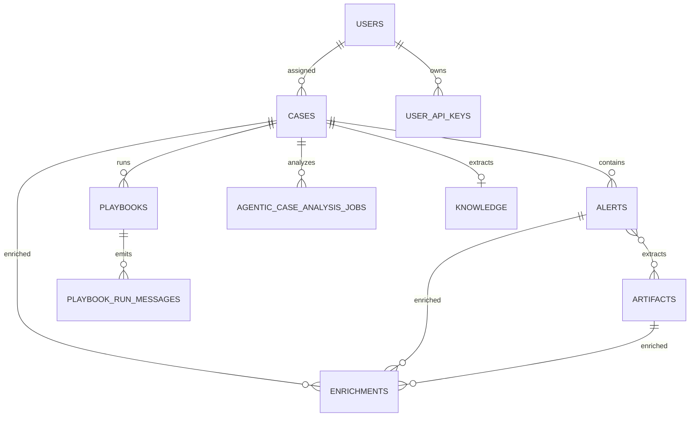

# PostgreSQL data model

## How ASP uses PostgreSQL

PostgreSQL is ASP's authoritative relational store. Django migrations in each app define its schema. Transactions protect job transitions, result writes, and enrichment upserts. Case-analysis enqueueing also combines a PostgreSQL advisory transaction lock with `SELECT ... FOR UPDATE` so one Case cannot acquire multiple Pending jobs concurrently.

Redis and RustFS are not additional PostgreSQL databases. Redis holds rebuildable caches, realtime messages, Streams, and heartbeats. RustFS holds attachment objects. Attachment metadata and all business relationships remain in PostgreSQL.



## Business tables

The field summaries omit some constraints, indexes, and enum members but cover every current ORM column category.

| Table | Important fields | Purpose and relationships |
| --- | --- | --- |
| `users` | Django user fields, avatar attachment, auth type, notification settings | Platform/LDAP users; assignees, actors, and recipients |
| `user_api_keys` | user, name, key, expiry and last-used timestamps | API Key credentials |
| `cases` | UUID/readable ID, triage fields, status/verdict, assignee, correlation UID, AI fields/report | Investigation aggregate root |
| `case_relationships` | source/target Case, type, note, creator, pair key | Directed links between Cases |
| `alerts` | Case FK, detection/rule/MITRE/product/risk fields, raw JSON | Security detections belonging to one Case |
| `artifacts` | UUID/readable ID, name/type/role/value | Indicators, identities, and assets reusable across Alerts |
| `alerts_artifacts` | Alert FK, Artifact FK | Alert–Artifact many-to-many join table |
| `enrichments` | summary fields, provider data JSON, nullable Case/Alert/Artifact FKs | Context attached at exactly one investigation level |
| `playbooks` | Case, name, input/user, status/id, timestamps, remark | Durable Playbook queue and outcome |
| `playbook_run_messages` | run, sequence, message, timestamp | Ordered progress messages |
| `knowledge` | title/body/expiry/source/tags, unique Case FK | Manual or Case-extracted reusable knowledge |
| `agentic_case_analysis_jobs` | Case, status, trigger, timestamps, error, result JSON | Durable LLM analysis queue and history |
| `comments` | generic FK, author, parent, body | Nested comments on supported resources |
| `attachments` | access UUID, S3 file key, filename, size, uploader/time | Relational metadata for RustFS objects |
| `audit_logs` | generic FK, action/actor, changes/metadata JSON | Business and administrative audit trail |
| `inbox_messages` | kind, sender/parent, generic FK, resource, body/metadata | Message body and resource reference |
| `inbox_message_recipients` | message, user, read time | Recipients and read state |
| `user_table_preferences` | user, table key, page size, column JSON | Per-user table configuration |
| `saved_table_filters` | owner, table key, name, state JSON, visibility | Saved queue filters |

## Settings tables

| Table | Stored configuration |
| --- | --- |
| `setting_llm_provider_configs` | OpenAI-compatible URL/model/key/proxy/tags/enabled/priority |
| `setting_ti_alienvault_otx_config` | OTX enabled/key/base URL/proxy |
| `setting_ti_opencti_config` | OpenCTI enabled/URL/token/TLS/proxy |
| `setting_siem_splunk_config` | Splunk connection and TLS settings |
| `setting_siem_elk_config` | ELK connection and Action index polling settings |
| `setting_ldap_config` | LDAP server, domain, bind, and search settings |
| `setting_runtime_config` | Prompt language, Stream maximum length, dashboard refresh interval |
| `setting_custom_variables` | Typed JSON variables and a secret marker for modules/Playbooks |

Singleton setting models use `singleton_id` to represent one logical row. LLM providers and custom variables allow multiple records.

## Django and join tables

Django supplies `auth_permission`, `auth_group`, `auth_group_permissions`, `django_content_type`, and `django_session`. `users_groups` and `users_user_permissions` link the custom User. Other implicit joins are `comments_mentions`, `comments_attachments`, and `inbox_messages_attachments`; `inbox_message_recipients` is an explicit through model.

## Relational versus JSON data

Relationships are used where ASP needs filtering, cascade behavior, and referential integrity. JSON holds variable provider/event payloads, audit diffs, UI state, and analysis snapshots. `enrichments.data` remains in PostgreSQL but the current Investigation profile only sends name/type/provider/value/description to the LLM. The complete LLM result is snapshotted in job `result_json`, while commonly queried report and classification fields are denormalized back onto the Case.

## Migrations and checks

```bash
cd backend
uv run python manage.py migrate
uv run python manage.py showmigrations
uv run python manage.py check
```

Every model change requires a generated and applied Django migration. These documentation changes do not alter the database.
