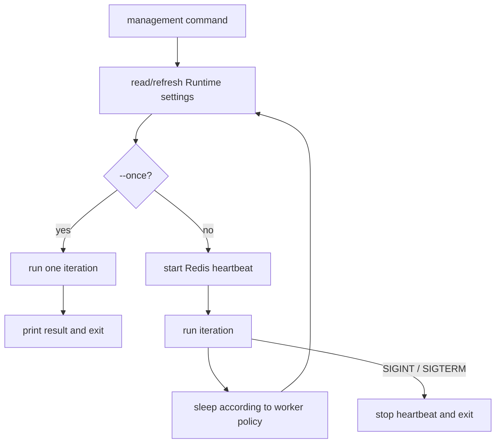
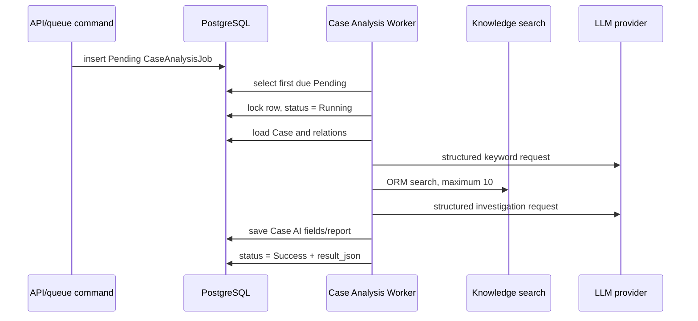

# Workers and Agentic Runtime

## Process model

A worker is a long-running Django management-command process. The common runner refreshes cached Runtime settings before every iteration. Continuous mode reports a heartbeat to Redis, logs an iteration failure, and continues. `--once` performs one iteration and surfaces failures as `CommandError`, making it useful for diagnosis and orchestration.

Every common worker accepts:

- `--once`: run one polling iteration and exit.
- `--interval SECONDS`: override the idle or fixed polling interval; it must be positive.



## Five worker types

| Command | Input/queue | Work | Sleep policy |
| --- | --- | --- | --- |
| `run_elk_action_worker` | ELK Action index | Poll documents, normalize, and write Redis Streams | Fixed sleep every iteration; index/size/start time can be overridden |
| `run_agentic_module_worker` | Redis Streams group `agentic-modules` | Dynamically load Modules and create/link Cases, Alerts, Artifacts, Enrichments | Sleep when idle; 3-second default |
| `run_agentic_case_analysis_worker` | PostgreSQL `agentic_case_analysis_jobs` | Claim a due job, serialize evidence, retrieve knowledge, invoke LLM, persist structured output | Sleep when idle; 3-second default |
| `run_agentic_playbook_worker` | PostgreSQL `playbooks` | Claim a run, load its Playbook, call integrations, save messages/outcome | Sleep when idle; 3-second default; recover orphaned runs at startup |
| `run_dashboard_cache_worker` | Timer | Aggregate PostgreSQL dashboard data into Redis cache, guarded by Redis locks | Fixed interval from Runtime settings by default |

Health is stored in Redis hashes named `worker-health:v1:{worker_type}`. Expected types are `agentic-module`, `case-analysis`, `playbook`, `elk-action`, and `dashboard-cache`. Heartbeats are neither work queues nor durable run history.

The local `start.sh` currently starts the Case-analysis and Playbook workers, not all five expected types. Start Module, ELK Action, and Dashboard Cache workers separately when those capabilities are required.

## Agentic Runtime

Runtime is the dynamic script loading and execution layer, not a container runtime and not the LLM itself.

### Module Runtime

The worker scans `backend/custom/modules/*.py`. A script must define a top-level `Module` subclass of `BaseModule` with `STREAM_NAME`; `NAME` and `THREAD_NUM` are optional. Relative imports are rejected. A consumer name combines hostname, process ID, and module name, while all consumers share the `agentic-modules` group.

Stream reads currently use `noack=True`: delivery is at-most-once from ASP's perspective. A message is not retried when decoding or module execution fails. The error is logged and processing continues. `THREAD_NUM` is discovered as metadata but does not currently spawn threads; concurrency comes from running additional worker processes. Modules use services and transactions to persist records and can generate stable correlation UIDs from a rule, time bucket, and key set.

### Playbook Runtime

A script defines a `Playbook` subclass of `BasePlaybook`. ASP first inserts a PostgreSQL run. The worker locks and changes one Pending row to Running, discovers a script by name, and supplies its Case and user input. A Playbook can read custom variables and language-specific Markdown prompts and append ordered run messages. It writes Success or Failed plus timestamps and remarks. On worker startup, orphaned Running rows are marked failed so they cannot remain stuck indefinitely.

### Case Analysis Runtime



PostgreSQL advisory and row locks deduplicate Pending work for the same Case. The state machine is Pending → Running → Success/Failed. Failed jobs retain their error and are not automatically retried.

## Running and diagnosing

Local scripts place PID and log files in `.asp-runtime/`. Use `kill -0 "$(cat FILE.pid)"` and tail the corresponding log. Foreground checks include:

```bash
cd backend
uv run python manage.py run_agentic_module_worker --once
uv run python manage.py run_agentic_case_analysis_worker --once
uv run python manage.py run_agentic_playbook_worker --once
uv run python manage.py run_dashboard_cache_worker --once
```

One iteration does not mean “drain the backlog.” Repeat it or run continuous mode to process all queued work.
